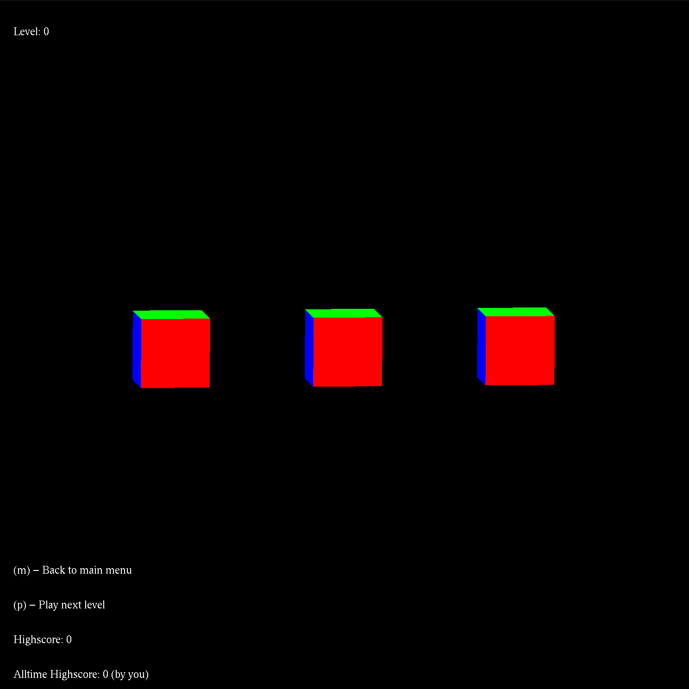

# Trace the Cube
A simple OpenGL video game. Project submission for CS402 (Computer Graphics) @ MUST University.

# How to play
You're shown the position of a small cube that hides under of of the large cubes at the beginning of the level, then they spin; keep track of where the small cube is to advance to the next level. Simple and sweet. (Levels get progressively harder, try to keep your name on the leaderboard). 

## Team Members
| Name        | ID           |
| ------------- |:-------------:|
| [Nour Gaser](https://github.com/nourgaser)      | 89553      |
| [Rokaia Medhat](https://github.com/1Rooky)      | 89380      |
| [Ahmed Khaled Kira](https://github.com/ahm3dkira)      | 89671      |
| [Wafaa Wael](https://github.com/wafaawael)      | 89551      |
